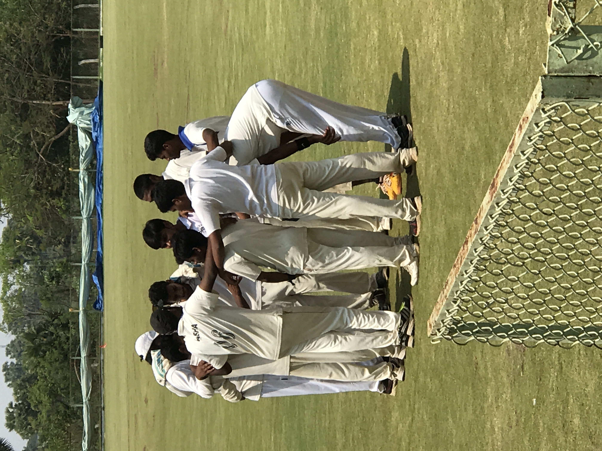
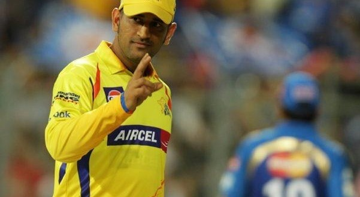
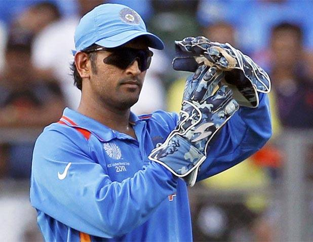

#  _VARRE VIDYA SAGAR_

Here is my [LinkdIN Pofile](https://www.linkedin.com/in/varre-vidya-sagar-170b3511b/)

Here is my [facebook profile](https://www.facebook.com/vidyasagarchinnu143/)

Here is my [Instagram profile](https://www.instagram.com/vidyasagar_chinnu/)

Here is my [Contact info]**(8978477670)**

Here is my mail ID **varrevidyasagar@gmail.com**

# SOLO VS SQUAD BATTLE

<iframe width="560" height="315" src="https://www.youtube-nocookie.com/embed/KvWJ5Snwpw8" frameborder="0" allow="accelerometer; autoplay; clipboard-write; encrypted-media; gyroscope; picture-in-picture" allowfullscreen></iframe>

# MATCH
Match Between ECE 3 vs ECE 4
**Venue:**

Dr PVG Raju ACA Sports Complex is a cricket stadium located in Vizianagram of the Indian state of Andhra Pradesh. It was inaugurated on 15 June 2013.[1] The stadium is home of North Zone Cricket Academy of Andhra Cricket Association which was inaugurated at a cost of ₹50 million (US$700,000) on a 10 acres (4.0 ha) near MVGR College of Engineering. The stadium has facilities such as pavilion, lodging and boarding facilities and health centre

# CHENNAI SUPER KINGS 

Year	League standing	Final standing
2008	3rd out of 8	Runners-up
2009	2nd out of 8	Semifinalists
2010	3rd out of 8	**Champions**
2011	2nd out of 10	**Champions**
2012	4th out of 9	Runners-up
2013	1st out of 9	Runners-up
2014	3rd out of 8	Playoffs
2015	1st out of 8	Runners-up
2018	2nd out of 8	**Champions**
2019	2nd out of 8	Runners-up
2020	7th out of 8	League stage

# MAHENDRA SINGH DHONI

Mahendra Singh Dhoni who  born on 7 July 1981 , is a former Indian international cricketer who captained the Indian national team in limited-overs formats from 2007 to 2016 and in Test cricket from 2008 to 2014. Under his captaincy, India won the inaugural 2007 ICC World Twenty20, the 2010 and 2016 Asia Cups, the 2011 ICC Cricket World Cup and the 2013 ICC Champions Trophy. A right-handed middle-order batsman and wicket-keeper, Dhoni is one of the highest run scorers in One Day Internationals (ODIs) with more than 10,000 runs scored and is considered an effective "finisher" in limited-overs formats.He is widely regarded as one of the greatest wicket-keeper batsmen and captains in the history of the game. He was also the first wicket-keeper to effect 100 stumpings in ODI cricket.

Dhoni made his ODI debut on 23 December 2004 against Bangladesh, and played his first Test a year later against Sri Lanka. He has been the recipient of many awards, including the ICC ODI Player of the Year award in 2008 and 2009 **(the first player to win the award twice)**, the Rajiv Gandhi Khel Ratna award in 2007, the Padma Shri, India's fourth highest civilian honour, in 2009 and the Padma Bhushan, India's third highest civilian honour, in 2018. Dhoni was named as the captain of the ICC World Test XI in 2009, 2010 and 2013. He has also been selected a record 8 times in ICC World ODI XI teams, 5 times as captain. The Indian Territorial Army conferred the honorary rank of Lieutenant Colonel to Dhoni on 1 November 2011. He is the second Indian cricketer after Kapil Dev to receive this honour.

